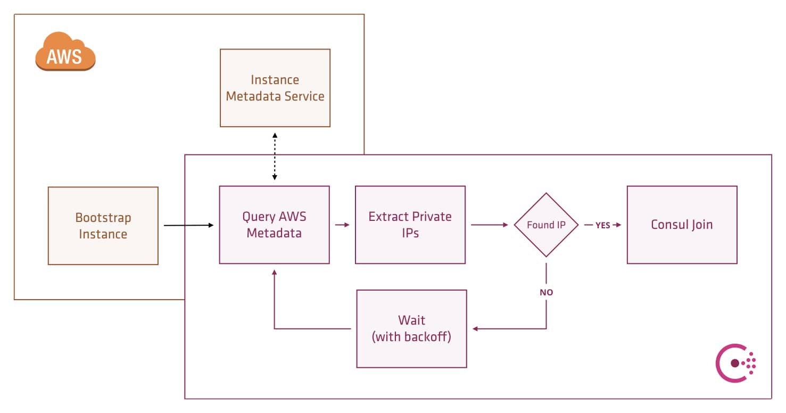

# Consul Auto-Join Example
This repository demonstrates using Consul auto-join to create and update a Consul cluster on AWS.

Consul 0.7.5 introduced new functionality which allows it to discover other agents using cloud metadata. This blog post explores leveraging AWS metadata to auto-join and auto scale a Consul cluster.

The [latest documentation for Consul](https://www.consul.io/docs/agent/options.html) shows new options we can specify in the Consul configuration file or startup parameters.

- `-retry-join-ec2-tag-key` - The Amazon EC2 instance tag key to filter on. When used with `-retry-join-ec2-tag-value`, Consul will attempt to join EC2 instances with the given tag key and value on startup.
- `-retry-join-ec2-tag-value` - The Amazon EC2 instance tag value to filter on.
- `-retry-join-ec2-region` - (Optional) The Amazon EC2 region to use. If not specified, Consul will use the local instance's EC2 metadata endpoint to discover the region.

The new feature requires permission to read the AWS instance state, and there are a variety of options available to grant these permissions.

- Static credentials (from the config file)
- Environment variables (`AWS_ACCESS_KEY_ID` and `AWS_SECRET_ACCESS_KEY`)
- Shared credentials file (`~/.aws/credentials` or the path specified by `AWS_SHARED_CREDENTIALS_FILE`)
- ECS task role metadata (container-specific)
- EC2 instance role metadata



The method we are using in this example is the EC2 role metadata.  By assigning the `ec2:DescribeInstances` permission to the instances IAM role, we can give Consul this permission without leaking any other control over your AWS account.

```
{
  "Version": "2012-10-17",
  "Statement": [
    {
      "Effect": "Allow",
      "Action": "ec2:DescribeInstances",
      "Resource": "*"
    }
  ]
}
```


To start and bootstrap the cluster modify the file terraform.tfvars to add your AWS credentials and default region and then run `terraform plan`, `terraform apply` to create the cluster.

```
aws_region = "us-east-2"

aws_profile = "default"
```

Once this is all up and running, you will see some output from Terraform showing the IP addresses of the created agents and servers.

```bash
Outputs:

clients = [
    34.253.136.132,
    34.252.238.49
]
servers = [
    34.251.206.78,
    34.249.242.227,
    34.253.133.165
]

```

After provisioning, it is possible to login to one of the client nodes via SSH using the IP address output from Terraform.

```bash
$ ssh ubuntu@34.251.206.78
```

Running the `consul members` command will show all members of the cluster and their status (both clients and servers).

```bash
$ consul members
Node                  Address          Status  Type    Build  Protocol  DC
consul-demo-client-0  10.1.1.189:8301  alive   client  0.7.5  2         dc1
consul-demo-client-1  10.1.2.187:8301  alive   client  0.7.5  2         dc1
consul-demo-server-0  10.1.1.241:8301  alive   server  0.7.5  2         dc1
consul-demo-server-1  10.1.2.24:8301   alive   server  0.7.5  2         dc1
consul-demo-server-2  10.1.1.26:8301   alive   server  0.7.5  2         dc1
```

## Scale up
The cluster automatically bootstrapped with no human intervention, to simulate a failure scenario or scaling of the cluster again modify the `terraform.tfvars` file, increase the number of instances to 5 and then re-run `terraform plan` and terraform apply`.

```bash
$ terraform plan
Plan: 2 to add, 0 to change, 0 to destroy.
...
```

```bash
$ terraform apply
Apply complete! Resources: 2 added, 0 changed, 0 destroyed.

The state of your infrastructure has been saved to the path
below. This state is required to modify and destroy your
infrastructure, so keep it safe. To inspect the complete state
use the `terraform show` command.

State path: terraform.tfstate

Outputs:

clients = [
    34.253.136.132,
    34.252.238.49
]
servers = [
    34.251.206.78,
    34.249.242.227,
    34.253.133.165,
    34.252.132.0,
    34.253.148.148
]
```

Run `consul members` again after the new servers have finished provisioning. It might take a few seconds for the new servers to join the cluster, but they will be available in the memberlist:

```bash
Node                  Address          Status  Type    Build  Protocol  DC
consul-demo-client-0  10.1.1.189:8301  alive   client  0.7.5  2         dc1
consul-demo-client-1  10.1.2.187:8301  alive   client  0.7.5  2         dc1
consul-demo-server-0  10.1.1.241:8301  alive   server  0.7.5  2         dc1
consul-demo-server-1  10.1.2.24:8301   alive   server  0.7.5  2         dc1
consul-demo-server-2  10.1.1.26:8301   alive   server  0.7.5  2         dc1
consul-demo-server-3  10.1.2.44:8301   alive   server  0.7.5  2         dc1
consul-demo-server-4  10.1.1.75:8301   alive   server  0.7.5  2         dc1
```

## Scale down
The same applies when scaling down - there is no need to manually remove nodes, so long as we stay above the originally-configured minimum number of servers (3 in this example). To demonstrate this functionality, decrease the number of servers in the `terraform.tfvars` file and run `terraform plan` and `terraform apply` again. The deprovisioned server nodes will show in the members list as failed, but the cluster will be fully operational.

```text
Node                  Address          Status  Type    Build  Protocol  DC
consul-demo-client-0  10.1.1.189:8301  alive   client  0.7.5  2         dc1
consul-demo-client-1  10.1.2.187:8301  alive   client  0.7.5  2         dc1
consul-demo-server-0  10.1.1.241:8301  alive   server  0.7.5  2         dc1
consul-demo-server-1  10.1.2.24:8301   alive   server  0.7.5  2         dc1
consul-demo-server-2  10.1.1.26:8301   alive   server  0.7.5  2         dc1
consul-demo-server-3  10.1.2.44:8301   failed  server  0.7.5  2         dc1
consul-demo-server-4  10.1.1.75:8301   failed  server  0.7.5  2         dc1
```

## Cleanup
Do not forget to clean up after the example.  Running `terraform destroy` will remove all resources created by this example.

## Troubleshooting
These examples use new features of many of the tools. At the time of writing, the following versions were used:

- Terraform v0.9.0
- Consul v0.8.4
